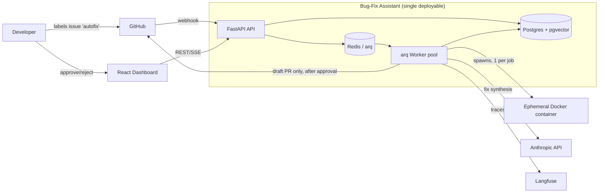
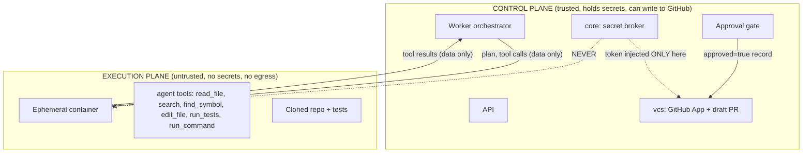

# Architecture — Autonomous Bug-Fixing Assistant

> Status: design baseline (v0.1). No code yet. This document is the contract the build
> plan executes against. Changes here should precede changes in code.

## 1. Mission in one sentence

Given a GitHub issue or stack trace on a Python repo, the system clones the repo into a
sandbox, reproduces the bug, localizes it, proposes a fix, verifies the fix against tests,
explains its reasoning, and opens a **draft** pull request for human review — never pushing,
merging, or opening a non-draft PR without recorded human approval.

## 2. Design principles

1. **Human gate is structural, not advisory.** Remote-write capability physically lives in a
   single, separately-authorized code path. The agent has no credentials that can push.
2. **Untrusted by default.** Repo code, issue text, comments, and filenames are adversarial
   input. They run only in sandboxes and can never reach a remote-write code path or a secret.
3. **One job, one container, one short-lived token.** Blast radius of any single job is one
   ephemeral container plus a per-install token scoped to one repo, expiring in minutes.
4. **Deterministic where possible, agentic where necessary.** Clone, index, test-run, diff,
   and PR creation are deterministic services. Only localization and fix synthesis are agentic.
5. **Everything is replayable.** Every tool call, result, and token spend is traced. Any past
   run can be reconstructed from the trace + artifacts without re-running the model.

## 3. System context

The whole thing is **one API service + one worker pool** (scope guard: no microservice sprawl).
The sandbox containers are spawned by workers, not by the API.

## 4. Component responsibilities

The repository follows the target layout in the build spec. Each top-level package under
`app/` is a bounded responsibility:

| Package | Responsibility | Key collaborators | Trust |
|---|---|---|---|
| `app/api` | HTTP surface: jobs, runs, webhooks, auth, dashboard SSE. No business logic beyond validation + enqueue. | workers (via queue), models | trusted |
| `app/agent` | Tool-use loop, planner, prompt templates, retry/budget controller, tool dispatch + allowlist enforcement. | index, runner, sandbox, telemetry | **mediates untrusted** |
| `app/vcs` | GitHub App auth, clone, branch, commit, **draft PR creation**. Sole owner of remote-write. | core (secrets), models (approvals) | trusted, privileged |
| `app/sandbox` | Container lifecycle, resource caps, egress control, capability dropping, workspace mounts. | runner, agent tools | **isolation boundary** |
| `app/index` | tree-sitter symbol index, ripgrep search, pgvector hybrid retrieval. | sandbox (reads workspace) | reads untrusted |
| `app/runner` | Test-framework detection, test execution (inside sandbox), output + stack-trace parsing. | sandbox | reads untrusted |
| `app/workers` | arq tasks, job state machine, orchestration of the full pipeline. | everything | trusted |
| `app/models` | SQLAlchemy 2.0 async models + Alembic migrations. | — | trusted |
| `app/core` | Config, settings, secret handling, tool allowlists, security primitives. | all | trusted, sensitive |
| `app/telemetry` | structlog setup, Langfuse trace emission, cost accounting, metrics. | all | trusted |
| `frontend/` | React + Vite + Tailwind dashboard. | api | client |
| `eval/` | SWE-bench-lite + custom buggy-commit harness, scoring. | full pipeline | offline |
| `docker/` | Base sandbox image (pytest, ripgrep, git, language runtimes). | sandbox | — |
| `deploy/` | fly.toml, docker-compose, GitHub Actions workflows. | — | — |

## 5. The two planes: control vs. execution

The single most important architectural split. Draw a hard line between them.

- The **execution plane** receives only data (file contents, diffs, test output). It never
  receives tokens, never has network egress, never calls GitHub.
- The **control plane** is the only place a GitHub token exists, and that token is only minted
  *after* an approval record exists for the job.
- The agent's `edit_file` writes to the sandbox workspace, not to a remote. Producing a diff is
  free; *applying* that diff to a remote requires crossing the gate.

## 6. Agent design

- **Model split (cost-aware):** localization/ranking uses a cheaper model; fix synthesis uses
  `claude-opus`. Both run through the same tool-use loop with the same allowlist.
- **Tools (the only ways the agent affects the world):** `read_file`, `search`, `find_symbol`,
  `edit_file`, `run_tests`, `run_command` (allowlisted commands only). Every call is validated
  against `app/core` allowlists *before* dispatch; a rejected call returns an error to the model,
  it is never executed.
- **Budgets:** per-job ceilings on tokens, wall-clock, tool-call count, and retry attempts.
  Exceeding any ceiling transitions the job to `failed` with a partial trace, never an open loop.
- **Guardrails on edits:** max diff size; CI config, lockfiles, and anything resembling secrets
  are flagged and surfaced, never silently edited.

## 7. Sandbox model

- One ephemeral Docker container per job. Non-root user, dropped Linux capabilities,
  read-only rootfs where feasible, writable only on the job workspace, **network egress off by
  default**, CPU/memory/PID/time caps, no host mounts beyond the single workspace volume.
- Cloning happens by the control plane streaming the repo into the workspace volume; the
  container itself has no network and no credentials.
- Killed and discarded at job end regardless of outcome. No reuse across jobs.
- Local fallback (subprocess with rlimits) exists only for developer machines without Docker
  and is **disabled in any deployed environment** by config.

## 8. Data & retrieval

- Postgres is the system of record (jobs, runs, artifacts, fixes, approvals — see DATA_MODEL.md).
- pgvector stores code-chunk embeddings for **fallback** semantic retrieval. Primary retrieval
  leads with ripgrep + the tree-sitter symbol index (fast, exact); vector search is the
  backstop when lexical search misses. (Cut-order note: semantic RAG is the last thing cut; grep
  + symbol index alone is a viable degraded mode.)
- Large artifacts (full diffs, logs, test output) are stored as artifact rows / object blobs and
  referenced by id, not inlined into model context.

## 9. Observability & cost

- `structlog` for structured app logs with a per-job correlation id.
- Langfuse captures the agent trace: every tool call, arguments, result, model, and token usage.
- Cost accounting aggregates token spend per job; metrics track resolve rate, regression rate,
  time-to-fix, and cost-per-fix. A run is fully reconstructable from trace + artifacts.

## 10. Deployment topology

- **Local:** docker-compose — api, worker, postgres (pgvector), redis, langfuse, frontend.
- **Cloud:** Fly.io app(s) for api + worker, managed Postgres and Redis, secrets in Fly secrets
  (not env files in git). Sandbox containers run on the worker host.
- **CI/CD:** GitHub Actions — test → build → push image → deploy, with Alembic migrations on
  deploy, healthchecks, and a documented rollback path.

## 11. Open decisions to confirm before coding

1. Python 3.12 is specified; this sandbox has 3.10. Build targets 3.12 (CI pins it); local dev
   on 3.10 is not supported — confirm acceptable.
2. Sandbox host for Fly.io: Docker-in-Docker vs. a dedicated worker VM with the Docker socket.
   Affects Phase 9 isolation guarantees — decide before Phase 7/13.
3. Langfuse: self-hosted (in compose) vs. cloud. Affects deploy + data residency.
4. Embedding model/provider for pgvector chunks (Phase 1 fallback retrieval).

See `BUILD_PLAN.md` for the phased sequence and `SECURITY.md` for the threat model.
