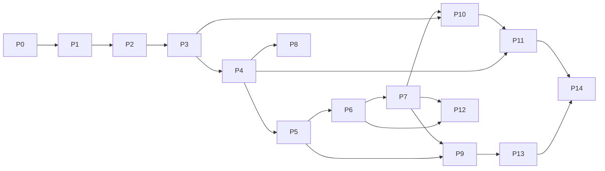

# Build Plan — Autonomous Bug-Fixing Assistant

> Executable, phase-by-phase. Run the acceptance test + commit after each phase before
> continuing. Do not skip ahead. Estimates assume one focused engineer (or agent) and are
> calibrated relative to each other, not as calendar promises.

## How to read this

Each phase lists: **Goal**, **Deliverables**, **Acceptance test** (automated), **Depends on**,
**Rel. size**, **Risk/notes**. Phases 4, 5, and 9 are **never cut**.

---

## Phase 0 — Project scaffold (pre-req, not in original spec)
- **Goal:** Repo skeleton matching the target layout; tooling baseline.
- **Deliverables:** package tree under `app/`, `frontend/`, `eval/`, `docker/`, `deploy/`,
  `docs/`; `pyproject.toml` (Python 3.12), ruff + mypy + pytest config; `pre-commit`; empty
  modules with typed interfaces; `.env.example` (no secrets); base `docker-compose.yml`; CI stub
  that runs lint + tests.
- **Acceptance:** `pytest` runs (0 tests ok), lint + type-check pass in CI.
- **Depends on:** none. **Rel. size:** S. **Risk:** low.

## Phase 1 — Repo brain
- **Goal:** Clone a repo into the workspace and answer "where is X defined / used".
- **Deliverables:** clone into sandbox workspace; tree-sitter symbol index (Python first);
  read tools `read_file`, `search` (ripgrep), `find_symbol`; pgvector hybrid retrieval
  (ripgrep-led, vector fallback); a thin CLI to exercise them.
- **Acceptance:** CLI answers "where is X defined / used" correctly on a real public repo.
- **Depends on:** 0. **Rel. size:** M. **Risk:** med (tree-sitter grammar setup).

## Phase 2 — Test runner + sandbox v1
- **Goal:** Detect and run pytest inside a capped ephemeral container; parse results.
- **Deliverables:** pytest detection; container run with CPU/mem/time caps; pass/fail parsing;
  **stack-trace parser → `{file, line, function}` frames**.
- **Acceptance:** a known-failing repo produces structured failure output with correct frames.
- **Depends on:** 1, Docker available. **Rel. size:** M. **Risk:** med (container plumbing).

## Phase 3 — Agent loop (core)
- **Goal:** Anthropic tool-use loop that can turn a known failing test green.
- **Deliverables:** tool-use loop; tools `read_file`, `search`, `find_symbol`, `edit_file`,
  `run_tests`, `run_command` (allowlisted); planning step; retry budget + token/time ceiling;
  allowlist validator wired in front of dispatch.
- **Acceptance:** on a repo with a known failing test, the agent produces a diff that turns it
  green.
- **Depends on:** 1, 2, Anthropic API key. **Rel. size:** L. **Risk:** high (core agent quality).

## Phase 4 — Issue → reproduce → localize → fix → explain  ⭐ CORE MILESTONE (never cut)
- **Goal:** Issue text in → verified patch + reasoning writeup out, on a real Python repo.
- **Deliverables:** parse issue/stacktrace into a task; reproduce bug, **writing a failing test
  if none exists**; rank suspect files; apply fix, re-run, self-correct within budget; reasoning
  writeup + change summary; guardrails (max diff size; flag — never silently edit — CI config,
  lockfiles, secrets).
- **Acceptance:** issue text → verified patch + writeup on a real Python repo.
- **Depends on:** 3. **Rel. size:** L. **Risk:** high. **Cut policy:** never.

## Phase 5 — GitHub integration (human-gated)  ⭐ never cut
- **Goal:** Real labeled issue → real **draft** PR, only after approval.
- **Deliverables:** GitHub App install-token auth; read issues; create branch + commit; open
  **draft** PR with reasoning as a PR comment; **explicit approval record required before any
  push** (enforced in `app/vcs`).
- **Acceptance:** real repo + labeled issue → real draft PR appears, only after approval.
- **Depends on:** 4. **Rel. size:** M. **Risk:** high (this is where remote-write lives — review
  against SECURITY.md C1/C4). **Cut policy:** never. **STOP-AND-ASK** before first real PR.

## Phase 6 — Backend API + data model + webhook
- **Goal:** Labeling an issue creates a queued job row via webhook.
- **Deliverables:** FastAPI async; Postgres + Alembic; models repos/jobs/runs/artifacts/fixes/
  approvals (see DATA_MODEL.md); webhook: issue labeled `autofix` → enqueue job; HMAC verify.
- **Acceptance:** labeling an issue creates a queued job row via webhook.
- **Depends on:** 5 (auth), 0. **Rel. size:** M. **Risk:** med.

## Phase 7 — Async workers
- **Goal:** Fire-and-forget jobs, pollable status, crash-recoverable.
- **Deliverables:** Redis + arq; job state machine (queued → running → awaiting_approval →
  done/failed); status endpoint; streamed logs; one isolated container per job.
- **Acceptance:** fire-and-forget job, pollable status, recoverable on worker crash.
- **Depends on:** 6. **Rel. size:** M. **Risk:** med (idempotency/recovery).

## Phase 8 — Multi-language adapters
- **Goal:** Fix a bug in each of Python, JS/TS, Go.
- **Deliverables:** plugin interface (detect, install deps, test command, stacktrace parse);
  JS/TS adapter; Go adapter; per-language sandbox base images.
- **Acceptance:** a verified fix in each of Python, JS/TS, Go.
- **Depends on:** 4, 2. **Rel. size:** L. **Risk:** med. **Cut policy:** extra languages are
  cut #2 (see cut-order).

## Phase 9 — Security hardening  ⭐ never cut, do not abbreviate
- **Goal:** Safe to point at arbitrary repos; red-team suite passes.
- **Deliverables:** ephemeral containers, dropped caps, non-root, read-only rootfs where
  feasible, egress off; per-install token scoping; tokens never in model context or logs;
  tool-call allowlist enforcement; **prompt-injection + red-team test suite** proving C1–C5
  (see SECURITY.md §3, §5).
- **Acceptance:** red-team suite passes.
- **Depends on:** 5, 7. **Rel. size:** L. **Risk:** high. **Cut policy:** never.

## Phase 10 — Observability + cost
- **Goal:** Any past run fully reconstructable; cost per job reported.
- **Deliverables:** structlog; full agent trace (every tool call + result) to Langfuse;
  token/cost accounting per job; metrics: resolve rate, regression rate, time-to-fix,
  cost-per-fix.
- **Acceptance:** any past run reconstructable from traces; cost per job reported.
- **Depends on:** 3, 7. **Rel. size:** M. **Risk:** low-med.

## Phase 11 — Eval harness
- **Goal:** One command runs the eval and prints a headline resolve-rate number.
- **Deliverables:** SWE-bench-lite + custom buggy-commit set; resolve-rate + regression-rate
  scoring; tuning loop (retry budget, localization ranking, prompts) with recorded score deltas.
- **Acceptance:** single command runs eval and prints headline resolve rate.
- **Depends on:** 4, 10. **Rel. size:** L. **Risk:** med (dataset wiring, runtime cost).

## Phase 12 — Dashboard
- **Goal:** Watch a fix live and approve from the UI.
- **Deliverables:** React + Vite + Tailwind; list runs; run detail; diff view; reasoning trace;
  live status (SSE); approve/reject buttons wired to the human gate.
- **Acceptance:** a fix can be watched live and approved from the UI.
- **Depends on:** 6, 7, 5. **Rel. size:** M. **Risk:** low-med. **Cut policy:** realtime UI is
  cut #1 (fall back to polling, then to API-only approval).

## Phase 13 — Deploy + CI/CD
- **Goal:** Live URL with reachable webhook; pushing to main deploys cleanly.
- **Deliverables:** dockerize all services; compose for local; Fly.io with managed Postgres +
  Redis + secrets manager; GitHub Actions test → build → push → deploy; migrations on deploy;
  healthchecks; rollback path.
- **Acceptance:** live URL with reachable webhook; push to main deploys cleanly.
- **Depends on:** 6, 7, 9. **Rel. size:** L. **Risk:** med-high. **Cut policy:** managed cloud is
  cut #3 → fall back to a single VPS + docker-compose.

## Phase 14 — Docs + demo
- **Goal:** A new engineer runs the system locally from the README alone.
- **Deliverables:** README; architecture diagram; how-it-works writeup; API docs; demo GIF + 90s
  recording of a real fix; final eval run for the headline number.
- **Acceptance:** new engineer can run locally from the README alone.
- **Depends on:** all. **Rel. size:** M. **Risk:** low.

---

## Dependency graph

## Critical path

`P0 → P1 → P2 → P3 → P4 → P5 → P9 → P13 → P14`. Phases 8, 10, 11, 12 hang off this spine and can
be parallelized once their dependencies land.

## Cut-order (if a phase will overrun — never cut 4, 5, 9)

1. **Realtime UI** → polling instead of SSE; then API-only approval, no dashboard.
2. **Extra languages** → Python only; defer JS/TS + Go (Phase 8).
3. **Managed cloud** → single VPS + docker-compose instead of Fly + managed services.
4. **Semantic RAG** → keep ripgrep + tree-sitter symbol index only; drop pgvector retrieval.

## Stop-and-ask gates (before any irreversible / network-egress / remote-write action)

- First time enabling network egress for anything.
- First real clone of an external repo (Phase 1 acceptance against a public repo).
- First GitHub App installation + first real draft PR (Phase 5).
- First cloud deploy + pointing a live webhook at a real repo (Phase 13).
- Running the eval harness at cost (Phase 11) — confirm spend ceiling first.

## Definition of done (from spec)

Deployed at a live URL; a labeled issue on a real Python repo flows end-to-end to a verified fix
in a draft PR with a reasoning writeup, gated on human approval, fully traced and cost-accounted,
with a measured resolve-rate number from the eval harness — all reproducible from the README.
