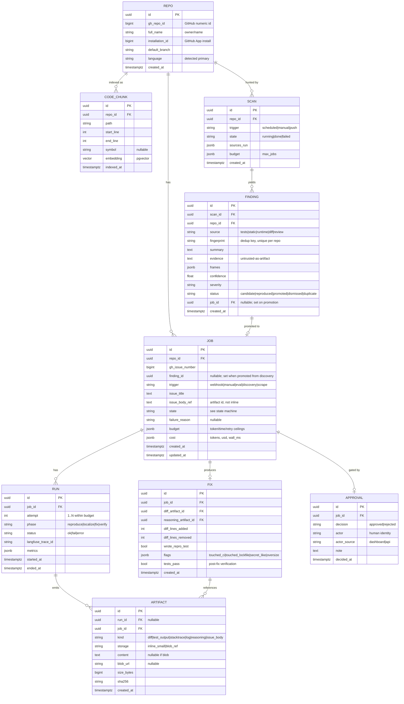
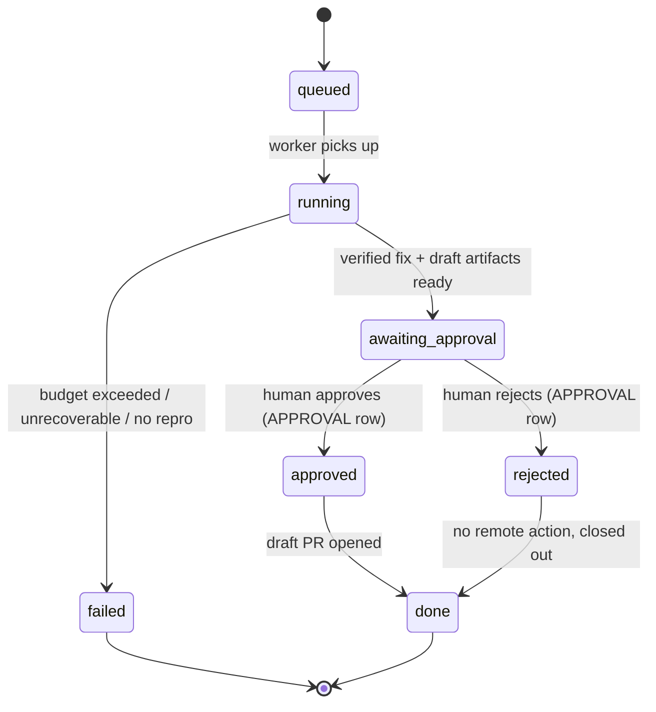

# Data Model — Autonomous Bug-Fixing Assistant

> Postgres + SQLAlchemy 2.0 (async) + Alembic. pgvector for embeddings. This is the logical
> model; column types are indicative, not final DDL. Secrets are never stored here in plaintext.

## 1. Entity overview

## 2. Table notes

- **REPO** — one row per installed repo. `installation_id` links to the GitHub App install used
  to mint short-lived tokens at PR time; the token itself is never stored.
- **JOB** — the unit of work. `issue_body_ref` points at an ARTIFACT rather than inlining
  untrusted issue text into a hot table. `budget` captures the ceilings the agent runs under;
  `cost` is the running tally (filled by telemetry).
- **RUN** — one per attempt-phase. Holds the `langfuse_trace_id` so a row links straight to its
  full agent trace. Multiple runs per job because the agent self-corrects within budget.
- **ARTIFACT** — append-only. Small payloads inline; large ones (full diffs, logs) stored as a
  blob and referenced. `sha256` lets the dashboard and eval harness verify integrity.
- **FIX** — the proposed patch. `flags` carries the guardrail outcomes (oversize diff, touched
  CI/lockfile, secret-like content). A fix can exist with `tests_pass=false`; it just won't be
  eligible to advance past the gate.
- **APPROVAL** — **the human gate, persisted.** No remote write happens unless an `approved`
  row exists for the job. Immutable once written; a reversal is a new row.
- **CODE_CHUNK** — pgvector embeddings for fallback semantic retrieval; rebuilt per repo index.
- **SCAN** (Phase 13) — one proactive bug-hunt over a repo. `sources_run` records which detectors
  ran; `budget` caps how many findings may be promoted to jobs.
- **FINDING** (Phase 13) — a discovery candidate. `fingerprint` (rule id + normalized location +
  symbol) is **unique per repo**, so a re-scan can never refile a known finding. `evidence` holds
  untrusted scanner/stacktrace output, treated as an artifact (never executed at rest). On
  promotion, `status` becomes `promoted` and `job_id` links the discovery JOB (which carries
  `finding_id` back). Reproduction — not the finder — is the precision filter.

## 3. Job state machine

Rules:
- The transition `approved → done` is the **only** path that triggers a remote write, and it is
  executed solely by `app/vcs` after reading the APPROVAL row.
- A job in `awaiting_approval` holds no live token and no running container — it is inert until a
  human acts.
- Crash recovery (Phase 7): a worker dying mid-`running` leaves the job re-claimable; idempotency
  keys on RUN attempts prevent double work. `awaiting_approval`/`failed`/`done` are terminal to
  workers.

## 4. Invariants (enforced in code + tested)

1. No row, column, log line, or artifact ever contains a GitHub token or API key in plaintext.
2. A draft PR (recorded as a `done` job with a PR url artifact) implies a matching `approved`
   APPROVAL row with an earlier `decided_at`.
3. `FIX.flags.oversize == true` or any `touched_*` flag blocks auto-advance; the gate still
   requires a human, and the dashboard surfaces the flag prominently.
4. ARTIFACT is append-only; FIX and APPROVAL are immutable after creation.

## 5. Indexes & retrieval

- B-tree: `job(repo_id, state)`, `run(job_id, attempt)`, `artifact(job_id, kind)`,
  `approval(job_id)`.
- pgvector: IVFFlat/HNSW index on `code_chunk.embedding`, scoped by `repo_id` at query time.
- Retrieval order at agent time: ripgrep + symbol index first; pgvector nearest-neighbor only as
  fallback (see ARCHITECTURE.md §8).

## 6. Migrations

Alembic from day one (Phase 6). Each phase that adds tables ships its own migration; no manual
schema edits. Migrations run on deploy (Phase 13) before the new image takes traffic.
