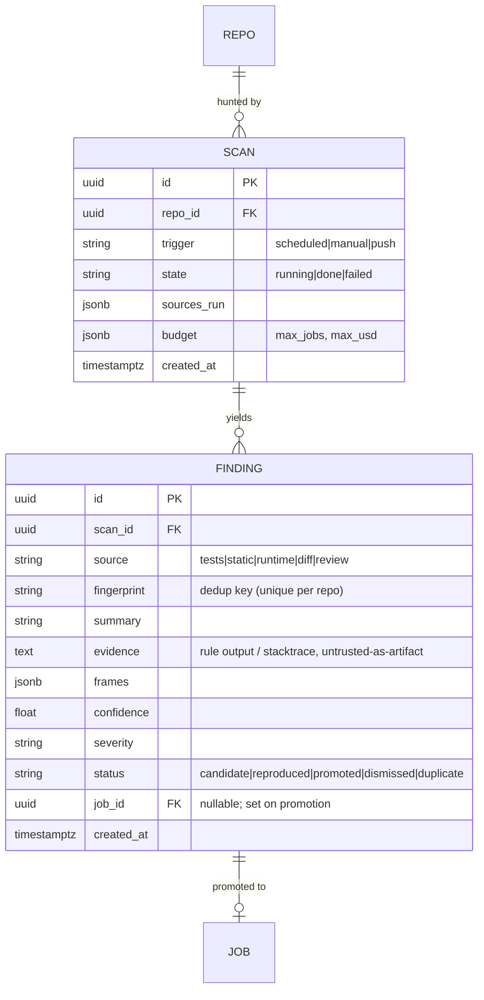

# Phase 13 — Proactive Bug Discovery

> Status: **built.** `app/discovery/` (detectors → triage → promote), `scan`/`finding` tables +
> migration, `bugfix-scan` CLI, `/findings` + `/scans` API, and a dashboard Findings tab all ship;
> offline-tested end-to-end in `tests/integration/test_discovery_acceptance.py`. Slots **after
> Phase 12, before Deploy (now Phase 15)** as an optional capability. Adds a *job source*, not a new
> fix path — everything downstream of a candidate is the existing reproduce → fix → verify →
> human-gated draft PR flow.

## 1. Goal

Today the system is **reactive**: a human files (or labels) an issue, and that issue drives a job.
Phase 13 makes it **proactive**: point it at a repo, have it *hunt* for latent bugs, and feed each
credible candidate into the exact same pipeline — ending, as always, at a human-gated draft PR.

## 2. The load-bearing idea: reproduction is the filter

A proactive bug-finder's hardest problem is **false positives** — drowning maintainers in
"maybe-bugs." We already have the antidote: Phase 4 only advances a job if the agent can
**reproduce the bug as a failing test**. So discovery is allowed to be noisy and cheap, because a
candidate that can't be turned red is silently dropped before it ever costs an Opus fix or a
human's attention.

```
discovery (noisy, cheap)  →  reproduce (the gate)  →  fix → verify → human → draft PR
        many candidates         few survive               (unchanged existing flow)
```

This inverts the usual trust model: we don't need the finder to be precise, we need it to be
*recall-oriented and cheap*, and let reproduction enforce precision.

## 3. Discovery sources (tiered, cheap → expensive)

Mirror the repo's existing "lead with the cheap deterministic signal, fall back to the model"
philosophy (ripgrep before vectors). Each source emits **candidates**, never fixes.

1. **Existing test signal (free).** Run the suite as-is via the Phase 8 adapters. Already-failing
   or flaky tests *are* reproduced bugs — they skip discovery entirely and become high-confidence
   candidates with a real failing test in hand.
2. **Static analysis (cheap, deterministic).** Run language-native tools **inside the sandbox**:
   `ruff`/`mypy`/`bandit` (Py), `tsc --noEmit`/`eslint` (JS/TS), `go vet`/`staticcheck` (Go), and
   a cross-language pass with **Semgrep/CodeQL** rulesets. Type errors, null-deref patterns,
   resource leaks, unhandled exceptions, injection patterns → structured candidates with a
   file/line/rule.
3. **Runtime evidence (cheap, high-value).** Pull real crashes from **Sentry/Datadog** (connectors
   exist in this environment). A production stack trace is the single best candidate — it's a real
   failure with frames the Phase 2 parser already understands.
4. **Differential / regression hunting (medium).** Diff recent commits; flag behavior changes with
   no accompanying test, or churn in historically buggy files (git blame hotspots).
5. **LLM code review (expensive, last).** Cheap model (**Haiku**) reviews ranked hotspots for
   logic bugs the deterministic tools miss (off-by-one, wrong operator, swapped args). Used as the
   *fallback*, scoped to files the cheaper signals already flagged — never a blind whole-repo sweep.

## 4. New module + where it plugs in

```
app/discovery/
  sources/            # one analyzer per signal, behind a Detector protocol
    tests.py  static.py  runtime.py  diffs.py  review.py
  scan.py             # orchestrates sources over a cloned repo (in-sandbox)
  finding.py          # Finding model + fingerprint() for dedup
  triage.py           # rank + budget-cap + dedup -> which findings become jobs
  promote.py          # Finding -> synthetic IssueTask -> enqueue a normal job
```

Each `Detector` runs in the **same ephemeral sandbox** as everything else (untrusted code; no new
trust boundary — see §7). `scan.py` fans them out and collects `Finding`s.

## 5. The seam to the existing flow (this is the whole trick)

A `Finding` is converted to the **same `IssueTask` that `parse_issue` already produces** — title,
body, error_type, frames, referenced_paths, identifiers. From there it is *indistinguishable* from
a human-filed issue, so `solve_issue` (Phase 4), the worker pipeline (Phase 7), the guardrails
(Phase 4), and the human gate (Phase 5/12) all apply **with zero changes**.

```python
# app/discovery/promote.py  (sketch)
def finding_to_task(f: Finding) -> IssueTask:
    return IssueTask(
        title=f.summary,
        body=f.evidence,                 # rule output / stack trace / review note
        frames=f.frames,                 # already in {file,line,function} shape
        referenced_paths=f.paths,
        identifiers=f.symbols,
        source="discovery",              # provenance, for metrics + UI
    )
# then: ingest as a JOB with trigger="discovery" and enqueue (same path as the webhook)
```

The only new `trigger` enum value is `"discovery"` (you already have `webhook|manual|eval`).

## 6. Triage & cost control (non-negotiable for proactive mode)

Hunting a whole repo can spawn hundreds of candidates → token blowout. `triage.py`:

- **Dedup** via `Finding.fingerprint()` (rule id + normalized location + symbol) against (a) prior
  findings, (b) open issues, (c) open PRs — never refile what's already known or in flight.
- **Rank** by confidence × severity × blast-radius, reusing `rank_suspects` signals.
- **Budget cap**: a scan has a max number of promoted jobs and a max USD spend, enforced like the
  Phase 11 `--confirm` spend gate. Everything above the cap is stored as a `Finding`, not a job.
- **Reproduce-before-fix economy**: promotion runs only the *reproduce* step first (cheap model). A
  candidate that won't go red is dismissed **before** any Opus fix spend.

## 7. Security (no new trust boundary)

- Discovery **reads and executes untrusted code** (scanners, the test suite) — so it runs **only in
  the Phase 2/9 sandbox**: non-root, caps dropped, egress off, resource-capped. Adding scanners
  means adding their binaries to the sandbox images and the **command allowlist** (`ruff`, `mypy`,
  `semgrep`, `eslint`, `go vet`, …) — each a new C5 allowlist entry with a red-team test.
- Runtime-evidence sources (Sentry/Datadog) are **control-plane egress**, like Langfuse — scrub
  payloads with the Phase 9 `scrub()` before they enter a trace or the model context (C4).
- **No new remote-write.** Discovery still terminates at `awaiting_approval`; the only GitHub
  mutation remains the human-gated draft PR. C1 is untouched.
- A malicious repo that plants a fake "bug" can at most cause a wasted, sandboxed, human-reviewed
  job — it cannot exfiltrate or push.

## 8. Data model additions



`JOB` gains nothing but the `trigger="discovery"` value and an optional `finding_id` backref.

## 9. Trigger & UX

- **Scheduled** (the natural mode): a cron/`scheduled-task` runs a scan nightly per repo.
- **Manual**: `bugfix-scan run <repo> --sources static,runtime --max-jobs 5 --confirm` (spend gate,
  like `bugfix-eval`).
- **Dashboard (Phase 12 extension)**: a "Findings" tab — review candidates, see which reproduced,
  one-click *promote to job* (which then flows to the existing approve/draft-PR gate). This keeps a
  **human in the loop at discovery too**, optionally gating *which* candidates get fixed.

## 10. Acceptance test

Point a scan at a repo with a **known latent bug that has no issue and no failing test** (e.g. a
mypy-detectable `None` deref on an unexercised path). Expected: the scan emits a candidate →
reproduce writes a failing test → fix → verify green → job parked at `awaiting_approval` with a
draft-PR-ready patch and a writeup citing the discovery source. A second scan re-runs and **does
not** refile the same finding (dedup). All offline-testable with scripted detectors + the
`LocalSandbox`, exactly like the existing acceptance tests.

## 11. Risks & cut-order

- **Noise/cost** is the top risk → mitigated by reproduce-as-filter + the triage budget cap. Start
  with sources 1–3 (deterministic + runtime); add 4–5 only once precision is measured.
- **Maintainer trust**: too many low-value PRs erodes it → keep the discovery human gate (§9) on by
  default; auto-promote nothing initially.
- **Cut-order**: within Phase 13, drop the LLM-review source first (cut #1), then diff-hunting; the
  static + runtime + existing-test sources alone are a useful, cheap product.
- Reuses the metrics from Phase 10 — add **precision (promoted/candidates)** and **fix-yield
  (draft-PRs/scan)** so you can tell if proactive mode is earning its keep.
