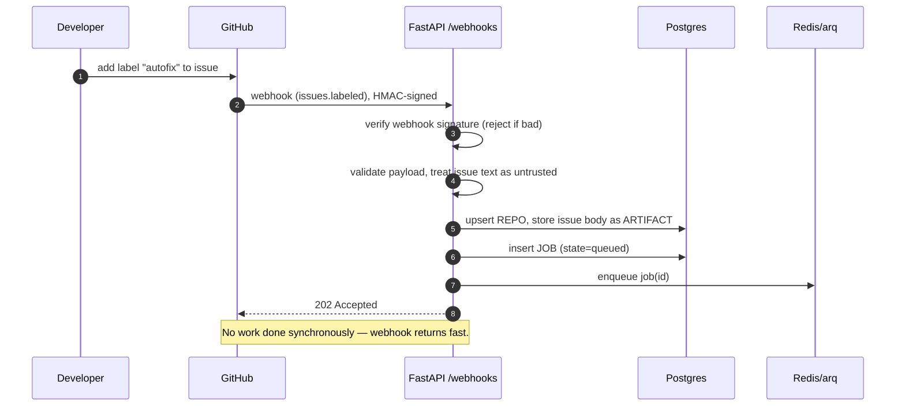
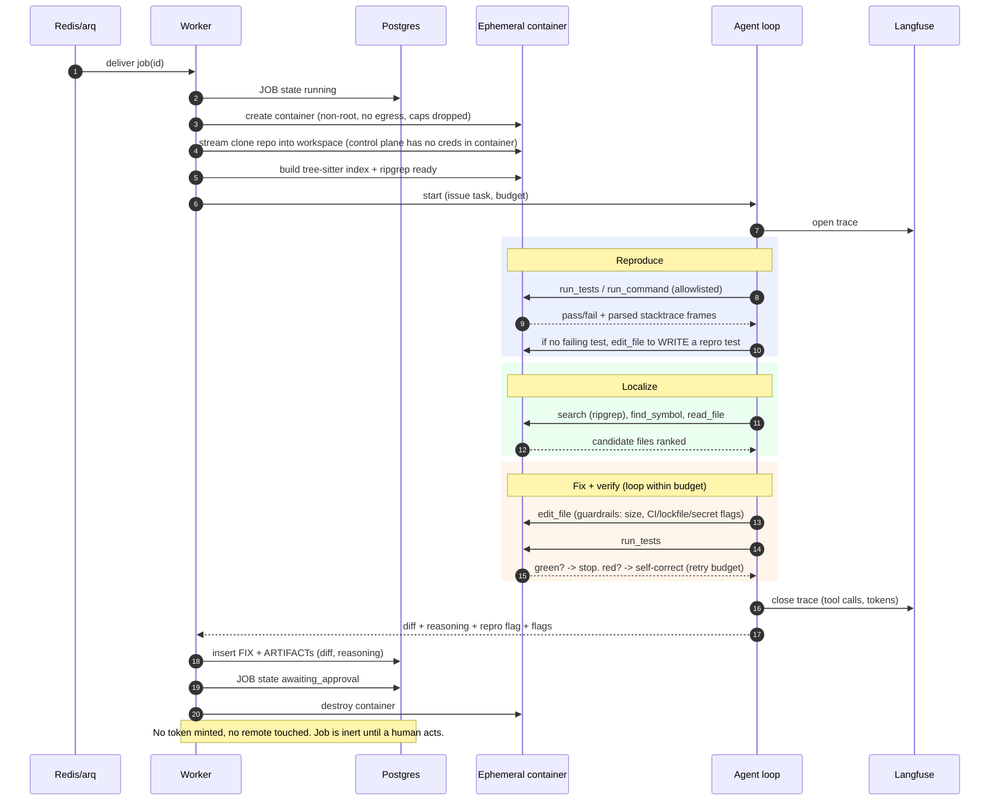
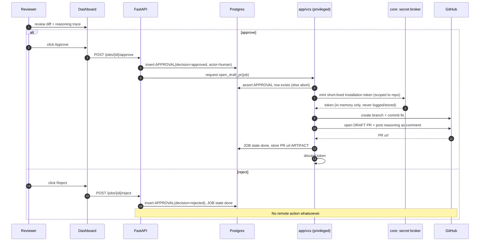
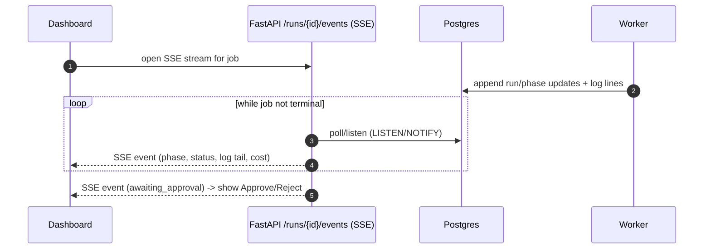

# Sequence Diagrams — Autonomous Bug-Fixing Assistant

> The four flows that matter. Each maps to phases in `BUILD_PLAN.md`. Mermaid renders on GitHub
> and most markdown viewers.

## 1. Issue labeled → queued job (Phase 6)

## 2. Worker orchestration: full pipeline (Phases 3–4, 7)

## 3. Human gate → draft PR (Phase 5)

Hard rule shown above: `VCS` refuses to act unless it can read an `approved` APPROVAL row, and
the token is minted *inside* that path, used, and discarded. The agent never sees it.

## 4. Live status to the dashboard (Phase 12)

## Cross-references

- Trust-plane split and why the agent can't push: `ARCHITECTURE.md` §5.
- State transitions and the approval invariant: `DATA_MODEL.md` §3–4.
- Isolation controls behind "no egress / caps dropped": `SECURITY.md`.
